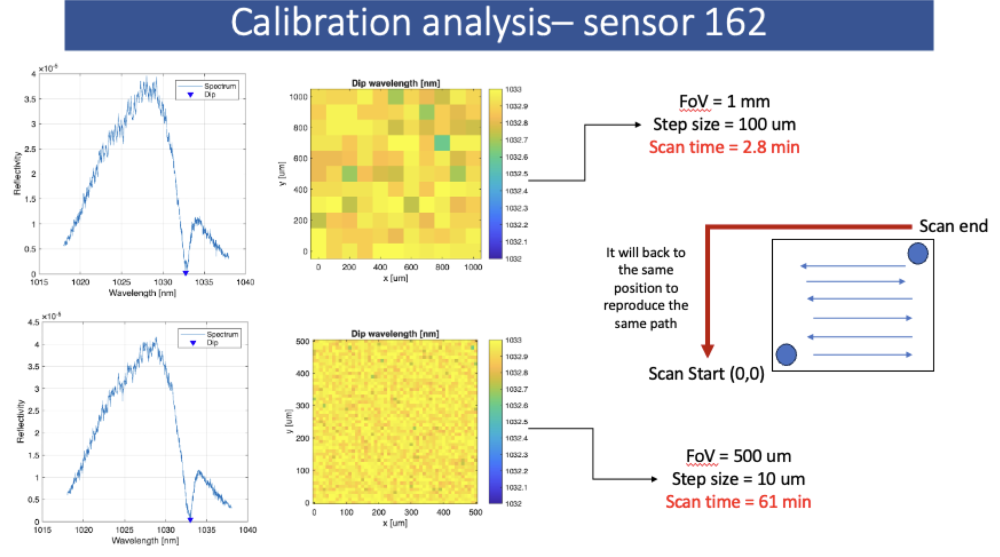
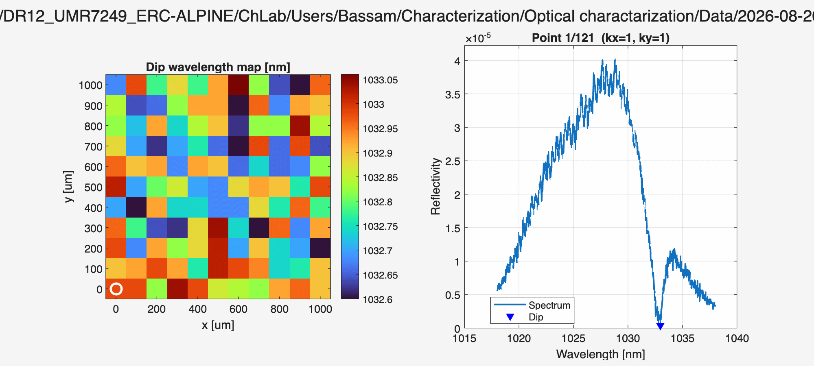

# Scanning the Sensor

A scanning platform that measures the homogeneity of the sensor surface and determines the optimal wavelength, the one corresponding to the most sensitive slope in the reflectivity spectrum.

## Overview

The system integrates two Thorlabs piezoelectric motors with an optical spectrum analyzer (OSA). The motors connect to the sensor cage mount and provide a movement resolution of 1 µm.

## Code Structure

| File | Description |
|------|-------------|
| `FP_scan_acquire.m` | Integrates the motor raster scan with the OSA and acquires the data from the OSA |
| `FP_calib_analyze.m` | Analyzes the acquired data |
| `YokogawaOSA.m` | Optical spectrum analyzer (OSA) class |
| `KIM101Motor.m` | Motor class |

   
  <em>Scan results.</em>

  

